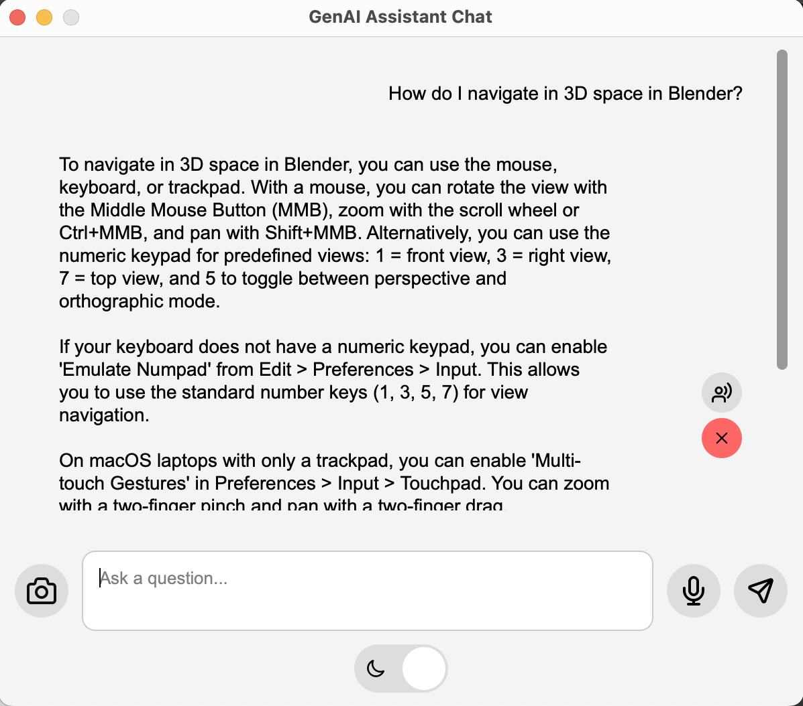
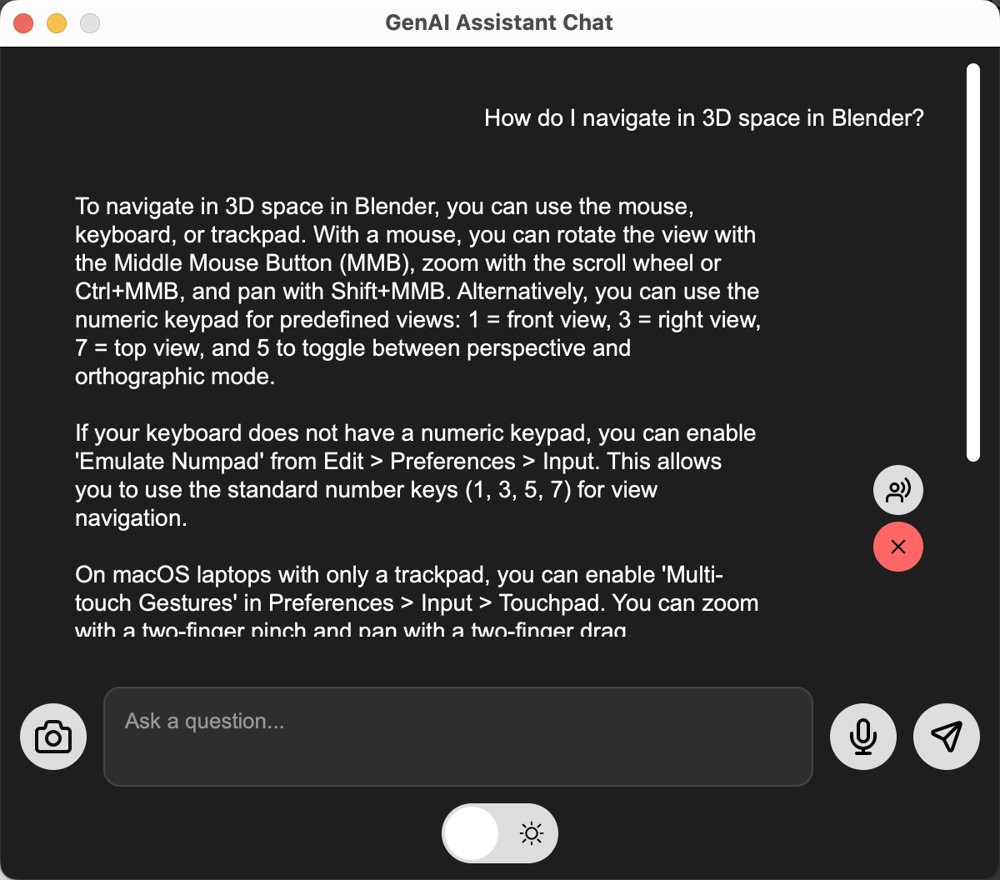

<div align="center">
  

  <p>
    
    
    <br>
    
    
    
    
  </p>


  <h1> 🤖 Blender GenAI Assistant 🤖</h1>
  <p>
    Questo progetto propone un sistema di supporto intelligente per Blender, basato su modelli GenAI per assistere nella modellazione 3D in modo contestuale e multimodale.

Sviluppato per il corso di **Computer Graphics & Multimedia** (A.A. 2024/2025) presso l’**Università Politecnica delle Marche**, tenuto dal **Prof. Primo Zingaretti**, coadiuvato dai **Dott. Emanuele Balloni** e [**Dott. Lorenzo Stacchio**](https://github.com/lorenzo-stacchio).

Realizzato da **Simone Recinelli**, **Diego Santarelli** e **Andrea Marini**.
  </p>
</div>

---


# 👆🏼 Indice

- [📌 Funzionalità del sistema](#-funzionalità-del-sistema)
- [🧹 Struttura del progetto](#-struttura-del-progetto)
- [🛠️ Tecnologie utilizzate](#-tecnologie-utilizzate)
- [⚖️ Documentazione Blender (PDF)](#-documentazione-blender-pdf)
- [📑 Documentazione Blender (JSON)](#-documentazione-blender-json)
- [⚙️ Requisiti e Setup](#-requisiti-e-setup)
  - [✅ Dipendenze Python: installazione automatica](#-dipendenze-python-installazione-automatica)
  - [📦 Clonare il repository](#-clonare-il-repository)
  - [📥 Installare l'addon su Blender](#-installare-laddon-su-blender)
  - [🚀 Avviare l'interfaccia](#-avviare-linterfaccia)
- [🎙️ Avvio manuale dello Speech Server](#-avvio-manuale-dello-speech-server)
- [🪟 Interfaccia del Chatbot](#-interfaccia-del-chatbot)
  - [✨ Caratteristiche principali della GUI](#-caratteristiche-principali-della-gui)
- [📊 Demo](#-demo)
- [👨‍💼 Autori](#-autori)
- [📄 Licenza](#-licenza)


---

# 📌 Funzionalità del sistema

Il sistema Blender GenAI Assistant integra strumenti intelligenti per assistere l’utente nella modellazione 3D in modo contestuale, multimodale e interattivo. Le funzionalità sono accessibili sia da Blender che da un’interfaccia grafica esterna.

- 🧠 **Assistenza intelligente** alla modellazione
  - 🔍 **Suggerimenti contestuali** su operazioni, strumenti e tecniche avanzate
  - 📚 **Sistema RAG** integrato con ricerca semantica nella documentazione Blender
  - 🧠 **Prompt dinamico** che include automaticamente dettagli della scena, selezione attiva e stato del modello
  - 🧪 **Analisi tecnica** del modello selezionato: vertici, UV, manifold, normali invertite, materiali, modificatori, ecc.
- 💬 Interfaccia grafica (GUI) esterna
  - 🪟 **GUI PyQt5 esterna** separata da Blender, in stile chat moderna
  - 💡 **Tema scuro/chiaro dinamico** in base alle preferenze Blender
  - 🔁 **Gestione asincrona** delle risposte AI, senza blocchi dell’interfaccia
  - 💾 **Storico chat persistente**, con salvataggio automatico
- 🖼️ **Multimodalità e visualizzazione**
  - 📷 **Cattura automatica di screenshot** da Blender con anteprima in GUI
  - 🧠 **Input visuale nel prompt**, utile per scene complesse o debugging visivo
- 🎙️ **Interazione vocale**
  - 🎤 **Dettatura vocale** delle domande via server Flask con Whisper (fino a 2 min, con silenzio automatico)
  - 🔊 **Lettura vocale** delle risposte generate (TTS, es. voce "Samantha" su macOS)
- ⚙️ **Automazioni e compatibilità**
  - 🔄 **Installazione automatica delle dipendenze** Python in scripts/modules/ di Blender
  - 🔒 **Avvio singleton della GUI**, riportata in primo piano se già aperta
  - 🧹 **Reset automatico della chat** alla chiusura di Blender o dell’interfaccia
  - 🧠 **Script dedicato per indicizzazione documentazione PDF**, integrato con LangChain e FAISS
- 📚 **Sistema RAG** integrato con ricerca semantica nella documentazione Blender
  Sono stati implementati due approcci complementari:  
  1. **RAG basato su JSON tematici** → chunk generati manualmente, con maggiore coerenza semantica e risposte più mirate.  
  2. **RAG basato su parsing PDF** → copertura più ampia e facilmente aggiornabile, utile per domande trasversali sulla documentazione.  

---

# 🧹 Struttura del progetto

Di seguito viene illustrata l’organizzazione dei file e delle cartelle che compongono il progetto Blender GenAI Assistant, evidenziando il ruolo dei principali moduli e risorse a supporto delle funzionalità implementate:
```
blender_genai/
├── icons/                         # Icone SVG/PNG per GUI e pannello
├── .gitattributes                 # Configurazione Git
├── .gitignore                     # File esclusi dal versionamento
├── __init__.py                    # Inizializzazione pacchetto scripts
├── blender_chunks.json            # Chunk JSON tematici per RAG
├── blender_faiss_index.pkl        # Indice FAISS per il retrieval
├── book_sliced.pdf                # Documento PDF preprocessato in chunk
├── extern_gui.py                  # Interfaccia grafica esterna in PyQt5
├── genai_operator.py              # Operatori Blender per interazione con AI
├── gui_launcher.py                # Avvio separato della GUI esterna
├── langchain_rag_blender_pdf.py   # Script RAG basato su documentazione PDF
├── LICENSE                        # Licenza MIT del progetto
├── panel.py                       # Pannello UI in Blender (sidebar GenAI)
├── rag_from_json.py               # Script RAG basato su JSON tematico
├── README.md                      # Documentazione principale del progetto
├── server.py                      # Server Flask + gestione dipendenze
├── setup_env_mac.sh               # Script di setup per macOS (dipendenze Blender + Ollama + Whisper)
├── setup_env_win.bat              # Script di setup per Windows (dipendenze Blender + Ollama + Whisper)
├── speech_server.py               # Server Flask per riconoscimento vocale
└── utils.py                       # Funzioni core (RAG, embeddings, AI context)
```

---

# 🛠️ Tecnologie utilizzate

| Stack            | Tecnologie |
|------------------|------------|
| **AI Backend**   | Ollama + LLaMA 3.2 Vision, LLaMA 3 Instruct, Whisper (trascrizione vocale) |
| **Retrieval (RAG)** | FAISS, SentenceTransformers (e5-large-v2), LangChain (core + community + huggingface) |
| **Frontend**     | Blender 4.5 UI API (Python), PyQt5 (GUI esterna con tema dinamico, preview immagini, TTS) |
| **Server**       | Flask REST API (addon interno), Speech Server Flask per dettatura vocale |
| **Audio**        | SpeechRecognition, sounddevice, pyaudio, pyttsx3 (TTS), PortAudio, ffmpeg |
| **Sistema**      | NumPy, SciPy, PyMuPDF (documentazione PDF), regex, psutil, requests |
| **macOS only**   | PyObjC (AppKit, Quartz, Cocoa) per gestione finestra e screenshot |
| **Piattaforme**  | Blender 4.5 (Python 3.11 integrato), macOS (ARM/Intel), Windows 10/11 |

---

# ⚖️ Documentazione Blender (PDF)

Per permettere l'elaborazione della documentazione ufficiale di Blender **in locale**, il repository include il file `book_sliced.pdf`.  
Questo PDF rappresenta l’intero manuale suddiviso in sezioni, utile per avere un riferimento completo della documentazione.

# 📑 Documentazione Blender (JSON)

Accanto al PDF, il repository include anche un file `blender_chunks.json`.  
Si tratta di una versione **strutturata e semantica** della documentazione ufficiale di Blender, utilizzata dal sistema RAG (Retrieval-Augmented Generation) per fornire risposte più pertinenti.

## Struttura del JSON

Ogni entry del file ha questa forma:

```json
{
  "id": "02_008",
  "chapter": "2. Modeling",
  "topic": "Modifiers (Mirror, Subdivision Surface, Boolean, etc.)",
  "text": "Modifiers are non-destructive effects applied to objects. Mirror creates symmetry, Subdivision Surface smooths the mesh, Boolean allows logical operations between objects...",
  "keywords": [
    "modifiers",
    "mirror",
    "subdivision",
    "boolean",
    "objects",
    "symmetry"
  ]
}
```

- **id** → identificatore univoco progressivo (capitolo + indice)  
- **chapter** → capitolo del manuale (es. *Modeling, Animation, Materials*)  
- **topic** → argomento specifico (es. *Modifiers*)  
- **text** → spiegazione testuale estratta e pulita  
- **keywords** → parole chiave per la ricerca semantica e il recupero rapido dei chunk  

## Differenza con il PDF

- **PDF (`book_sliced.pdf`)** → rappresenta l’intera documentazione in formato lineare, utile come sorgente completa ma difficile da interrogare direttamente.  
- **JSON (`blender_chunks.json`)** → fornisce chunk tematici e granulari, ottimizzati per la ricerca semantica con FAISS e `sentence-transformers`.  

Grazie a questa struttura, l’addon è in grado di:  
- recuperare rapidamente i paragrafi rilevanti alla domanda  
- costruire un contesto preciso per l’LLM  
- evitare risposte generiche non basate sulla documentazione ufficiale

---
# ⚙️ Requisiti e Setup

## 🔑 Prerequisiti di sistema

Prima di eseguire gli script di setup, assicurati che siano soddisfatti i seguenti requisiti:

- **Blender 4.5** installato sulla macchina (con Python 3.11 integrato).  
- Sistema operativo compatibile:
  - macOS (Intel o Apple Silicon)  
  - Windows 10/11 (x64)  
- **Connessione Internet** attiva per il primo setup.  
- **Permessi di esecuzione**:
  - macOS → rendere eseguibile lo script con `chmod +x`  
  - Windows → avviare il Prompt dei comandi come **Amministratore**

---

## ✅ Dipendenze Python: installazione automatica
Non è necessario installare manualmente i pacchetti Python:  
le dipendenze vengono installate **automaticamente** tramite gli script inclusi (`.sh` per macOS, `.bat` per Windows).  

Tutti i pacchetti richiesti vengono salvati nella cartella:

- macOS:
```
~/Library/Application Support/Blender/4.5/scripts/modules/
```
- Windows:
```
%APPDATA%\Blender Foundation\Blender\4.5\scripts\modules\
```

Dipendenze installate:
- Flask – server locale per gestire richieste
- FAISS – similarity search
- sentence-transformers – embeddings semantici
- LangChain – orchestrazione RAG
- PyMuPDF – parsing PDF
- PyQt5 – interfaccia grafica esterna
- psutil – monitoraggio processi
- requests – API HTTP
- pyttsx3 – sintesi vocale
- SpeechRecognition – dettatura vocale
- sounddevice – input microfono
- openai-whisper – trascrizione audio
- torch – backend Whisper
- scipy – gestione audio
- numpy==1.26.4 – libreria numerica compatibile
- regex – parsing testuale avanzato  
- **Solo macOS**: pyobjc  
- **Sistema**: ffmpeg (installato automaticamente se assente)

---

## 📦 Clonare il repository
Clonare il progetto in locale con:

```bash
git clone https://github.com/SimoneRecinelli/blender_genai.git
cd blender_genai
```

---

## 🛠️ Setup automatico con script

Abbiamo fornito **2 script** che automatizzano l’installazione delle dipendenze:

| Sistema  | Script |
|----------|-------------------|
| **macOS**   | `setup_env_mac.sh` <br> Installa automaticamente tutte le dipendenze (presuppone che Homebrew, Git e Python siano già presenti) |
| **Windows** | `setup_env_win.bat` <br> Installa automaticamente tutte le dipendenze (presuppone che Git e Python siano già presenti) |

---

## ▶️ Come eseguire gli script

### macOS
1. Apri il terminale e vai nella cartella del progetto:
   ```bash
   cd ~/Desktop/blender_genai
   ```
2. Dai i permessi di esecuzione (solo la prima volta):
   ```bash
   chmod +x setup_env_mac.sh
   ```
3. Avvia lo script:
   ```bash
   ./setup_env_mac.sh
   ```

### Windows
1. Apri il **Prompt dei comandi** (`cmd.exe`) come **Amministratore**.  
2. Vai nella cartella del progetto:
   ```bat
   cd Desktop\blender_genai
   ```
3. Esegui lo script:
   ```bat
   .\setup_env_win.bat
   ```

---

## 📥 Installare l'addon su Blender
Per installare il progetto come addon Blender:

1. Comprimi la cartella **blender_genai** in un file `.zip`.  
2. Apri Blender.  
3. Vai su **Modifica > Preferenze > Add-ons**.  
4. Clicca sull’icona a freccia in alto a destra e scegli **Install from Disk**.  
5. Seleziona lo `.zip` appena creato e conferma.  
6. Se necessario, spunta la casella per attivare l’addon.

---

## 🚀 Avviare l’interfaccia
Una volta installato l’addon:

1. Premi **N** per aprire la sidebar a destra nella 3D View.  
2. Vai nella sezione **GenAI**.  
3. Clicca sul bottone **Apri Chat Esterna** per lanciare l’interfaccia PyQt5.  

Da qui potrai:
- 💬 Chattare con l’assistente in tempo reale  
- 🖼️ Inviare screenshot della scena Blender  
- 🎙️ Usare la dettatura vocale e ricevere risposte con sintesi vocale  
- 🤖 Ottenere risposte intelligenti, documentate e multimodali

---

## 🦙 Ollama e modelli richiesti
Non è necessario installare manualmente Ollama o scaricare i modelli:  
gli script di setup (`.sh` su macOS, `.bat` su Windows) si occupano **automaticamente** di:

- installare Ollama se non presente
- avviare il servizio Ollama in background
- scaricare i modelli richiesti:
  - `llama3.2-vision` → Chatbot multimodale: gestisce le domande con immagini/screenshot della scena Blender.
  - `llama3:instruct` → Chatbot testuale con RAG: usato per le domande esclusivamente testuali, basandosi su documentazione JSON o PDF.

⚠️ Affinché il plugin funzioni correttamente, Ollama deve essere **sempre attivo** sulla macchina:  
gli script provvedono ad avviarlo in automatico, ma se necessario puoi avviarlo manualmente con:

```bash
ollama serve
```
---

# 🪟 Interfaccia del Chatbot

L’addon include una interfaccia grafica personalizzata esterna sviluppata in PyQt5, progettata per offrire un'esperienza utente fluida e moderna, ispirata alle applicazioni di messaggistica. È completamente multi-piattaforma (macOS Apple Silicon e Windows), supporta la cronologia delle conversazioni, invio di immagini della scena Blender, e la modalità dark/light con switch dinamico.

#### ✨ Caratteristiche principali della GUI:

- ✅ Interfaccia separata da Blender, con comunicazione socket asincrona

- 💬 Area di chat con storico persistente e salvataggio automatico

- 🖼️ Supporto per l’invio di screenshot dalla scena Blender

- 🌗 Tema chiaro/scuro attivabile con uno switch animato

- ⌨️ Invio con Enter e a capo con Shift+Invio

- 🔁 Integrazione con il sistema RAG per risposte documentate

- 🎙️ Pulsante microfono per **dettatura vocale** delle domande

- 🔊 Pulsante audio per **lettura vocale** delle risposte del chatbot

- 📁 Il file dell’interfaccia è extern_gui.py, e si avvia automaticamente cliccando il bottone 'Apri Chat' all’interno del pannello Blender.

Una volta catturata la schermata in Blender, l'immagine compare in anteprima nella GUI: può essere cliccata per visualizzarla a schermo intero ed è accompagnata da un'icona del cestino per eliminarla e caricarne una nuova, se desiderato.

Di seguito si allegano due screen dell'interfaccia del chatbot realizzato, rispettivamente in light mode e dark mode:

<p align="center">
  
</p>

<p align="center">
  
</p>


---

# ⚠️🎙️ Avvio manuale dello Speech Server

Nel caso in cui lo `speech_server.py` non venga avviato automaticamente all’apertura della chat esterna, per utilizzare la **dettatura vocale** (Whisper), è necessario avviare manualmente il server Flask dedicato con i seguenti comandi:

- #### macOS:
```bash
"/Applications/Blender.app/Contents/Resources/4.5/python/bin/python3.11" speech_server.py
```

- #### Windows:
```powershell
& "C:\Program Files\Blender Foundation\Blender 4.5\4.5\python\bin\python.exe" speech_server.py
```

- Il server si avvia in locale su [http://127.0.0.1:5056](http://127.0.0.1:5056).  
- Una volta attivo, puoi premere il **pulsante microfono** nella GUI PyQt5 per iniziare la registrazione vocale.  
- Premi di nuovo il microfono per fermare e avviare la trascrizione.  

⚠️ Se la porta `5056` risulta occupata, chiudi il processo precedente con:  
```bash
lsof -i :5056   # macOS/Linux
taskkill /PID <PID> /F   # Windows
```

# 📊 Demo

[](https://youtu.be/GrTJXAU_2ls)

---

# 👨‍💼 Autori

- [Simone Recinelli](https://github.com/SimoneRecinelli) (Matricola S1118757)
- [Diego Santarelli](https://github.com/diegosantarelli) (Matricola S1118746)
- [Andrea Marini](https://github.com/AndreaMarini01) (Matricola S1118778)


---

# 📄 Licenza

Questo progetto è distribuito sotto licenza MIT.

---
